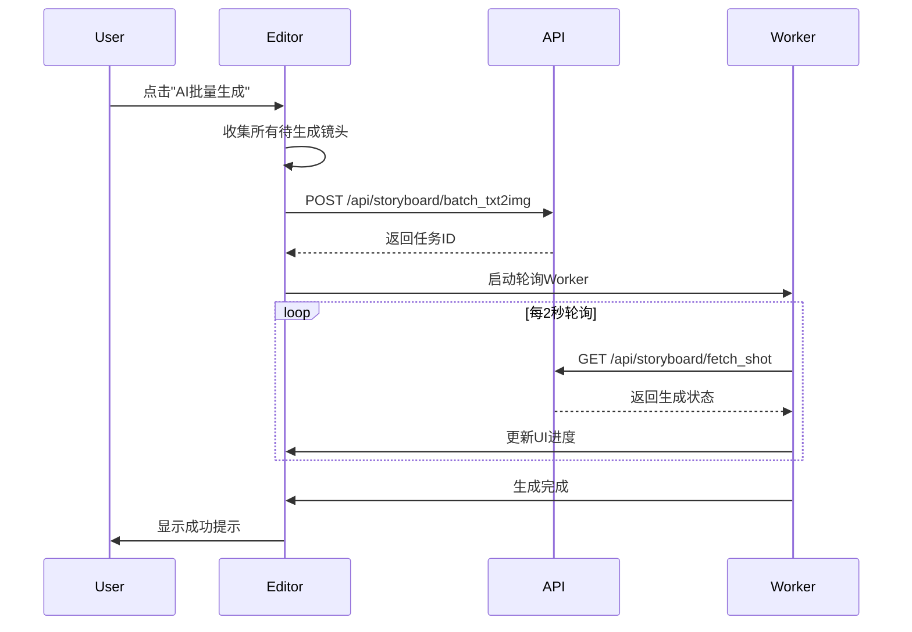

# 故事板编辑器 (TableView)

## 页面标识
- **页面名称**: Storyboard Editor / 故事板编辑器
- **URL路径**: `/dashboard/{projectId}/tableView`
- **URL示例**: `/dashboard/f6d162c030ddc58947585ce3925a8813/tableView`
- **页面类型**: 核心编辑工具
- **访问权限**: 需要登录且拥有项目权限

---

## 页面目标
1. 提供直观的表格式故事板编辑界面
2. 支持文本描述转AI图像生成
3. 管理视频分镜的顺序、时长、角色
4. 实时预览和调整
5. 保存和导出功能

---

## 布局结构

### 整体布局
```
┌───────────────────────────────────────────────────────────────┐
│                         顶部操作栏                             │
├───────────────────────────────────────────────────────────────┤
│                         工具栏                                 │
├───┬───────┬──────┬─────────────────┬────────┬────────┬────────┤
│ # │ 主角色 │ 选择 │  场景描述        │  时长   │ 预览图  │ 操作   │
├───┼───────┼──────┼─────────────────┼────────┼────────┼────────┤
│   │       │      │                 │        │        │        │
│   │  表格内容区域（可滚动）                                     │
│   │       │      │                 │        │        │        │
└───┴───────┴──────┴─────────────────┴────────┴────────┴────────┘
│                    底部状态栏                                  │
└───────────────────────────────────────────────────────────────┘
```

---

## 组件详细设计

### 1. 顶部操作栏

#### 布局
```
┌───────────────────────────────────────────────────────────────┐
│ [← 返回]  新建项目2025-10-24_13:21    [保存] [预览] [导出]      │
└───────────────────────────────────────────────────────────────┘
```

#### 组件元素

**返回按钮**:
```
图标: 左箭头
文本: "返回"
类型: 文本按钮
尺寸: 80px × 36px
交互: 返回Dashboard
```

**项目标题**:
```
文本: 项目名称
字号: 18px
字重: Medium
颜色: #1A1A1A
可编辑: 点击后变为输入框
```

**操作按钮组**（右侧）:

1. **保存按钮**:
   ```
   文本: "保存"
   类型: 次要按钮
   尺寸: 80px × 36px
   快捷键: Ctrl+S / Cmd+S
   状态:
     - 未修改: 禁用状态
     - 已修改: 可点击
     - 保存中: 显示加载图标
   ```

2. **预览按钮**:
   ```
   文本: "预览"
   类型: 次要按钮
   尺寸: 80px × 36px
   交互: 打开视频预览弹窗
   ```

3. **导出按钮**:
   ```
   文本: "导出"
   类型: 主要按钮
   尺寸: 80px × 36px
   交互: 打开导出选项菜单
   ```

   导出菜单:
   ```
   ┌─────────────────┐
   │ 导出为视频       │
   │ 导出为PDF        │
   │ 导出为图片序列   │
   │ 导出为文本脚本   │
   └─────────────────┘
   ```

#### 样式规范
```css
高度: 56px
背景: #FFFFFF
边框底部: 1px solid #E4E7EC
内边距: 0 24px
z-index: 100
```

---

### 2. 工具栏

#### 布局
```
┌───────────────────────────────────────────────────────────────┐
│ [+ 添加镜头] [删除选中] [AI批量生成] [导入文本] [更多▼]        │
└───────────────────────────────────────────────────────────────┘
```

#### 按钮功能

**添加镜头**:
```
图标: 加号
文本: "添加镜头"
功能: 在表格末尾添加新行
快捷键: Ctrl+Enter
```

**删除选中**:
```
图标: 垃圾桶
文本: "删除选中"
状态: 未选中时禁用
功能: 批量删除选中的镜头
```

**AI批量生成**:
```
图标: 魔法棒/星星
文本: "AI批量生成"
样式: 主色按钮
功能: 
  1. 对所有有描述但无图片的镜头生成图像
  2. 调用 /api/storyboard/batch_txt2img
  3. 显示生成进度
```

**导入文本**:
```
图标: 文档上传
文本: "导入文本"
功能: 
  1. 打开文本导入弹窗
  2. 支持粘贴文本或上传TXT文件
  3. 自动分割为多个镜头
```

**更多菜单**:
```
图标: 下拉箭头
下拉选项:
  - 批量设置时长
  - 批量设置角色
  - 清空所有镜头
  - 重新排序
```

#### 样式规范
```css
高度: 48px
背景: #F9FAFB
内边距: 8px 24px
按钮间距: 8px
```

---

### 3. 表格区域

#### 表格列结构

```
┌────┬─────────┬────────┬──────────────┬─────────┬─────────┬────────┐
│ #  │ 主角色   │ 选择   │  场景描述     │  时长    │ 预览图   │ 操作   │
│ 40 │  80     │  48    │    flex-1    │   80    │  120    │  60    │
└────┴─────────┴────────┴──────────────┴─────────┴─────────┴────────┘
单位: px (除场景描述为弹性宽度)
```

#### 列详细设计

##### 列1: 序号列 (#)
```
宽度: 40px
对齐: 居中
内容: 自动编号 (1, 2, 3...)
功能: 
  - 拖拽手柄（悬停时显示）
  - 支持拖拽排序
```

拖拽手柄:
```
图标: 六点拖拽图标(⋮⋮)
颜色: #98A2B3
悬停: 变为#667085
光标: grab / grabbing
```

##### 列2: 主角色列 (MainRoleCell)
```
宽度: 80px
组件: MainRoleCell
```

单元格结构:
```
┌───────┐
│ [头像] │
│  名称  │
└───────┘
```

元素:
- **头像**:
  ```
  尺寸: 40px × 40px
  形状: 圆形
  默认图: avatar.png
  边框: 1px solid #E4E7EC
  ```

- **角色名称**:
  ```
  字号: 12px
  颜色: #344054
  最大宽度: 70px
  溢出: 省略号
  默认值: "-"（无角色）
  ```

- **交互**:
  ```
  点击: 打开角色选择/编辑弹窗
  弹窗内容:
    - 选择现有角色
    - 创建新角色
    - 上传角色头像
    - 输入角色名称
  ```

##### 列3: 选择列 (SelectCell)
```
宽度: 48px
对齐: 居中
组件: SelectCell
```

复选框:
```
尺寸: 16px × 16px
样式: 圆角方形
边框: 1.5px solid #D0D5DD
选中: 背景主色，白色勾选图标
```

功能:
- 单选: 点击选中/取消
- 多选: Shift+点击范围选择
- 全选: 表头复选框

##### 列4: 场景描述列
```
宽度: flex-1 (弹性宽度)
最小宽度: 300px
组件: 多行文本编辑框
```

文本编辑框:
```
类型: textarea
最小高度: 60px
最大高度: 200px（超出显示滚动条）
内边距: 8px
字号: 14px
行高: 1.5
占位符: "请输入场景描述，例如：一个女孩站在海边看日落..."
```

功能:
- 自动调整高度
- 支持换行
- 字数统计（右下角显示）
- AI提示词建议（点击灯泡图标）

AI提示词建议:
```
图标: 灯泡💡
位置: 输入框右上角
点击: 显示推荐关键词
  - 镜头类型: 特写、全景、中景...
  - 动作: 站立、奔跑、微笑...
  - 环境: 室内、室外、海边...
  - 时间: 白天、夜晚、黄昏...
```

##### 列5: 时长列 (DurationCell)
```
宽度: 80px
对齐: 居中
组件: DurationCell
```

时长选择器:
```
类型: 数字输入 + 单位
格式: "3s" / "5s"
输入范围: 1-60秒
```

快捷选项:
```
点击显示下拉:
┌──────┐
│ 2s   │
│ 3s   │ ← 默认
│ 5s   │
│ 8s   │
│ 自定义 │
└──────┘
```

##### 列6: 预览图列
```
宽度: 120px
高度: 68px（16:9比例）
```

预览图显示:
```
┌──────────┐
│          │
│  图片    │
│          │
└──────────┘
```

状态:

1. **未生成**:
   ```
   显示: PlaceholderImg.jpg
   覆盖层: "待生成"文字
   ```

2. **生成中**:
   ```
   显示: 加载动画
   进度: 圆形进度条
   文字: "生成中..."
   ```

3. **已生成**:
   ```
   显示: AI生成的图片
   来源: static.chuangyi-keji.com/generate_storyboard_images/
   优化: ?x-oss-process=image/quality,q_50/resize,w_300
   ```

4. **生成失败**:
   ```
   显示: 错误图标
   文字: "生成失败"
   按钮: "重试"
   ```

交互:
- 点击: 放大预览
- 悬停: 显示操作按钮（重新生成、删除）

##### 列7: 操作列
```
宽度: 60px
对齐: 居中
```

更多菜单按钮:
```
图标: 三点菜单(⋮)
尺寸: 32px × 32px
点击: 显示下拉菜单
```

下拉菜单:
```
┌──────────────┐
│ 复制镜头      │
│ 插入镜头      │
│ 重新生成图片  │
│ 查看详情      │
│ ──────────   │
│ 删除镜头      │ ← 红色文字
└──────────────┘
```

---

### 4. 表格行状态

#### 默认行
```css
高度: 最小80px，自适应内容
背景: #FFFFFF
边框底部: 1px solid #F2F4F7
```

#### 悬停行
```css
背景: #F9FAFB
光标: pointer（序号列）
```

#### 选中行
```css
背景: #F0F5FF
左边框: 3px solid 主色
```

#### 拖拽中的行
```css
不透明度: 0.5
阴影: 0 4px 12px rgba(0,0,0,0.15)
```

---

### 5. 底部状态栏

#### 布局
```
┌───────────────────────────────────────────────────────────────┐
│ 共 12 个镜头  |  选中 3 个  |  总时长: 36s  |  [+ 添加镜头]      │
└───────────────────────────────────────────────────────────────┘
```

#### 信息显示
```
镜头统计: "共 {count} 个镜头"
选中统计: "选中 {count} 个" (有选中时显示)
总时长: "总时长: {duration}s"
```

#### 样式
```css
高度: 48px
背景: #F9FAFB
边框顶部: 1px solid #E4E7EC
内边距: 0 24px
字号: 14px
颜色: #667085
```

---

## 交互流程

### AI图像生成流程



### 保存流程

**自动保存**:
```
触发条件:
  - 内容修改后3秒无操作
  - 离开页面前
  - 定时保存（每30秒）
  
保存内容:
  - 所有镜头数据
  - 项目元信息
  
端点: POST /api/storyboard/project/save
```

**手动保存**:
```
触发: 点击保存按钮 / Ctrl+S
即时保存，显示保存状态
```

---

## API端点

### 获取镜头数据
```
端点: POST /api/storyboard/fetch_shot
请求体:
{
  "projectId": "f6d162c030ddc58947585ce3925a8813"
}

响应:
{
  "code": 200,
  "data": {
    "shots": [
      {
        "id": "shot_001",
        "order": 1,
        "mainRole": {
          "name": "小红",
          "avatar": "..."
        },
        "description": "一个女孩站在海边看日落",
        "duration": 3,
        "imageUrl": "static.chuangyi-keji.com/...",
        "status": "completed" / "pending" / "generating"
      }
    ]
  }
}
```

### 批量生成图像
```
端点: POST /api/storyboard/batch_txt2img
请求体:
{
  "projectId": "f6d162c030ddc58947585ce3925a8813",
  "shots": [
    {
      "shotId": "shot_001",
      "description": "一个女孩站在海边看日落"
    }
  ]
}

响应:
{
  "code": 200,
  "data": {
    "taskId": "task_12345",
    "estimatedTime": 30
  }
}
```

---

## 键盘快捷键

```
Ctrl+S / Cmd+S      : 保存
Ctrl+Z / Cmd+Z      : 撤销
Ctrl+Y / Cmd+Y      : 重做
Ctrl+C / Cmd+C      : 复制选中镜头
Ctrl+V / Cmd+V      : 粘贴镜头
Delete / Backspace  : 删除选中镜头
Ctrl+A / Cmd+A      : 全选
Ctrl+Enter          : 添加新镜头
↑ / ↓              : 上下移动选中行
Esc                 : 取消选择
```

---

## 性能优化

### 虚拟滚动
```
触发条件: 镜头数量 > 50
实现: 
  - 只渲染可视区域 ± 5行
  - 滚动时动态加载
  - 减少DOM节点
```

### 图片懒加载
```
策略:
  - 优先加载可视区域图片
  - 预加载下方2行
  - 使用缩略图
  - CDN加速
```

### 自动保存优化
```
防抖: 3秒
节流: 最多每10秒一次
差异保存: 只保存修改的字段
```

---

## 错误处理

### 生成失败
```
显示: 错误提示 + 重试按钮
原因:
  - AI服务超时
  - 描述不符合规范
  - 配额不足
```

### 保存失败
```
显示: 顶部错误条
操作:
  - 本地缓存数据
  - 提供离线编辑
  - 恢复后自动同步
```

---

## 数据埋点

### 页面事件
```javascript
// 进入编辑器
Amplitude.track('editor_opened', {
  project_id: 'f6d162c...',
  shot_count: 12
})

// AI生成
Amplitude.track('ai_generation_started', {
  shot_count: 5,
  batch: true
})

// 保存项目
Amplitude.track('project_saved', {
  auto_save: false,
  shot_count: 12,
  total_duration: 36
})
```

---

## 相关页面
- [Dashboard](./02-Dashboard.md)
- [视频预览](./06-视频预览.md)
- [导出页面](./07-导出.md)
