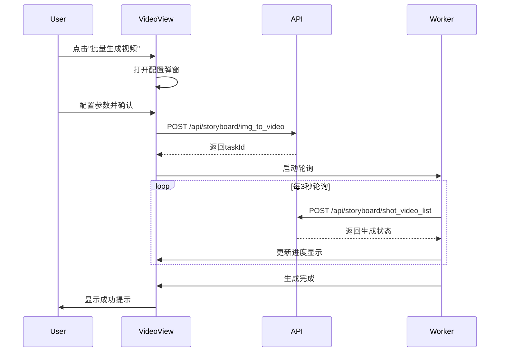

# 视频视图页面 (VideoView)

## 页面标识
- **页面名称**: Video View / 视频视图 / 视频编辑器
- **URL路径**: `/dashboard/:projectId/videoView`
- **URL示例**: `/dashboard/e8d297baeb01e1a0f0318c4daaaf584f/videoView`
- **页面类型**: 项目工作台视图（Tab视图之一）
- **访问权限**: 需要登录且拥有项目权限

---

## 页面目标
1. 展示所有分镜的视频列表
2. 提供视频时间轴编辑功能
3. 管理音频轨道和字幕
4. 实时预览视频效果
5. 配置视频导出设置

---

## 布局结构

### 整体布局
```
┌─────────────────────────────────────────────────────────────┐
│ 顶部导航栏 [Logo] [项目名] [保存][预览][导出]                 │
├─────────────────────────────────────────────────────────────┤
│ [剧本] [角色] [分镜表] [视频] ← Tab导航（视频为选中态）        │
├─────────────────────────────────────────────────────────────┤
│ ┌─────────────────┐ ┌───────────────────────────────────┐ │
│ │                 │ │                                   │ │
│ │  视频列表       │ │       视频预览区                   │ │
│ │  (左侧面板)     │ │                                   │ │
│ │                 │ │                                   │ │
│ └─────────────────┘ └───────────────────────────────────┘ │
│ ┌─────────────────────────────────────────────────────────┐ │
│ │              时间轴编辑器                                │ │
│ │  [视频轨道][音频轨道][字幕轨道]                          │ │
│ └─────────────────────────────────────────────────────────┘ │
└─────────────────────────────────────────────────────────────┘
```

---

## 组件详细设计

### 1. 视频列表面板（左侧）

#### 面板规格
```css
宽度: 280px
背景: #FFFFFF
边框右侧: 1px solid #E4E7EC
最小高度: calc(100vh - 160px)
```

#### 头部工具栏
```
┌────────────────────────────────┐
│ 视频列表 (共10个)   [⚙] [+]    │
└────────────────────────────────┘
```

组件元素:
- **标题**: "视频列表 (共{count}个)"
- **设置按钮**: 批量操作、排序方式
- **添加按钮**: 生成新视频

#### 视频卡片列表

卡片结构:
```
┌──────────────────────────┐
│ [缩略图]  分镜1           │
│           5s  ✓已完成    │
├──────────────────────────┤
│ [缩略图]  分镜2           │
│           3s  ⏳生成中... │
└──────────────────────────┘
```

卡片样式:
```css
高度: 80px
内边距: 12px
边框底部: 1px solid #F2F4F7

悬停态:
  背景: #F9FAFB
  光标: pointer
  
选中态:
  背景: #F0F5FF
  左边框: 3px solid 主色
```

卡片元素:
- **缩略图**: 120px × 68px (16:9)
- **标题**: 分镜序号/名称
- **时长**: 显示视频时长
- **状态图标**:
  - ✓ 已完成 (#10B981)
  - ⏳ 生成中 (#F59E0B)
  - ❌ 失败 (#F04438)
  - ⏸ 待生成 (#6B7280)

---

### 2. 视频预览区（右上）

#### 预览器规格
```css
宽度: flex-1
高度: 400px
背景: #000000
最小宽度: 600px
```

#### 播放器控制
```
┌─────────────────────────────────────┐
│                                     │
│       视频画面 (16:9)               │
│                                     │
├─────────────────────────────────────┤
│ [▶] ━━━━●━━━━ 00:05/00:36  [🔊][⛶] │
└─────────────────────────────────────┘
```

控制条功能:
- 播放/暂停按钮
- 进度条（可拖拽）
- 时间显示
- 音量控制
- 全屏按钮
- 播放速度选择 (0.5x, 1x, 1.5x, 2x)

---

### 3. 时间轴编辑器（底部）

#### 时间轴规格
```css
高度: 240px
背景: #FAFBFC
边框顶部: 1px solid #E4E7EC
```

#### 轨道结构
```
时间标尺: [0s──5s──10s──15s──20s──25s──30s──35s]
━━━━━━━━━━━━━━━━━━━━━━━━━━━━━━━━━━━━━━━━━━
视频轨道: [▮▮▮▮▮][▮▮▮][▮▮▮▮▮▮][▮▮▮]
音频轨道: [🔊━━━━━━━━━━━━━━━━━━━━━━━]
字幕轨道: [文字1][文字2]  [文字3]
```

轨道类型:

**1. 视频轨道**:
```
功能:
  - 展示所有视频片段
  - 拖拽排序
  - 修剪时长
  - 添加转场效果
  
视频片段样式:
  高度: 60px
  背景: #3B82F6
  圆角: 4px
  边框: 2px solid transparent
  悬停: 边框 #1E40AF
```

**2. 音频轨道**:
```
功能:
  - 添加背景音乐
  - 调整音量
  - 淡入淡出
  - 对话语音 (TTS)
  
音频片段样式:
  高度: 40px
  背景: #10B981
  波形显示: 可视化音频波形
```

**3. 字幕轨道**:
```
功能:
  - 添加字幕文本
  - 调整显示时间
  - 设置字幕样式
  
字幕片段样式:
  高度: 32px
  背景: #F59E0B
  文本: 显示字幕内容预览
```

#### 时间标尺
```css
高度: 30px
背景: #F9FAFB
字号: 12px
颜色: #667085

刻度:
  - 主刻度: 每5秒
  - 次刻度: 每1秒
  - 时间标签: 0s, 5s, 10s...
```

#### 播放指针
```css
宽度: 2px
颜色: #DC2626 (红色)
高度: 100% (穿过所有轨道)
阴影: 0 0 8px rgba(220, 38, 38, 0.5)
```

---

### 4. 视频生成控制面板

#### 批量生成按钮
```
位置: 视频列表顶部工具栏
文本: "批量生成视频"
图标: 魔法棒✨
样式: 主要按钮
功能: 调用 POST /api/storyboard/img_to_video
```

#### 生成配置弹窗
```
┌──────────────────────────────┐
│ 视频生成设置                  │
├──────────────────────────────┤
│ 生成模型: [seedance ▼]       │
│ 版本: [lite ○] [pro ○]       │
│ 分辨率: [480p ▼]             │
│ 默认时长: [5s ▼]             │
│                              │
│ 生成范围:                     │
│ ○ 全部分镜 (10个)            │
│ ○ 选中分镜 (3个)             │
│ ○ 自定义范围 [1-10]          │
│                              │
│     [取消] [开始生成]         │
└──────────────────────────────┘
```

配置项:
- **生成模型**: 从 GET /api/video_model/list 获取
- **版本选择**: lite / pro
- **分辨率**: 480p, 720p, 1080p
- **默认时长**: 2s, 3s, 5s, 8s, 自定义
- **生成范围**: 全部/选中/自定义

---

### 5. 音频管理

#### 音频库面板
```
触发: 点击音频轨道 "+" 按钮
位置: 右侧滑出面板
```

面板结构:
```
┌────────────────────────────┐
│ 添加音频                    │
├────────────────────────────┤
│ [本地上传] [音乐库] [AI生成]│
├────────────────────────────┤
│ 搜索: [________________]🔍 │
│                            │
│ 分类:                       │
│ □ 背景音乐                  │
│ □ 音效                      │
│ □ 对话语音                  │
│                            │
│ ┌──────────────────────┐  │
│ │ 🎵 轻音乐.mp3   3:24  │  │
│ │ [▶] [添加]            │  │
│ └──────────────────────┘  │
│                            │
│ ┌──────────────────────┐  │
│ │ 🎵 配乐-欢快.mp3 2:15 │  │
│ │ [▶] [添加]            │  │
│ └──────────────────────┘  │
└────────────────────────────┘
```

音频API:
- 获取标签: GET /api/audio/tag
- 对话TTS: GET /api/storyboard/dialogue_tts/{projectId}
- 上传音频: POST /api/audio/upload

---

### 6. 字幕编辑

#### 字幕编辑器
```
触发: 双击字幕轨道片段
位置: 模态弹窗
```

编辑器界面:
```
┌────────────────────────────────────┐
│ 编辑字幕                            │
├────────────────────────────────────┤
│ 文本内容:                           │
│ ┌────────────────────────────────┐ │
│ │ 在一个阳光明媚的早晨...         │ │
│ └────────────────────────────────┘ │
│                                    │
│ 显示时间: [05.00s] ~ [08.50s]      │
│                                    │
│ 字幕样式:                           │
│ 字体: [思源黑体 ▼]                 │
│ 大小: [16px ▼]                     │
│ 颜色: [⬜ #FFFFFF]                 │
│ 背景: [⬛ #000000] 透明度: [80%]   │
│ 位置: [底部居中 ▼]                 │
│                                    │
│ 动画效果: [淡入淡出 ▼]             │
│                                    │
│          [删除] [取消] [保存]       │
└────────────────────────────────────┘
```

字幕功能:
- 文本编辑
- 时间调整
- 样式定制
- 位置设置
- 动画效果

---

## 交互流程

### 视频生成流程



### 时间轴编辑流程

**1. 视频片段拖拽排序**:
```
1. 鼠标按下视频片段
2. 显示拖拽预览
3. 移动到目标位置
4. 释放鼠标
5. 更新轨道顺序
6. 自动保存更改
```

**2. 修剪视频时长**:
```
1. 选中视频片段
2. 拖拽左/右边缘
3. 实时显示时长变化
4. 释放后应用修改
5. 更新总时长
```

**3. 添加转场效果**:
```
1. 点击两个视频片段间的间隙
2. 选择转场类型（淡入淡出/切换/擦除等）
3. 设置转场时长（0.5s-2s）
4. 预览效果
5. 确认应用
```

---

## API端点

### 获取视频模型列表
```
端点: GET /api/video_model/list
响应:
{
  "code": 0,
  "data": {
    "models": [
      {
        "name": "seedance",
        "displayName": "SeeDance",
        "versions": ["lite", "pro"],
        "supportedResolutions": ["480p", "720p", "1080p"]
      }
    ]
  }
}
```

### 图片转视频
```
端点: POST /api/storyboard/img_to_video
请求体:
{
  "modelName": "seedance",
  "version": "lite",
  "image": "https://...",
  "duration": "5",
  "resolution": "480p",
  "storyboardId": "1981592200073023490",
  "projectId": "e8d297baeb01e1a0f0318c4daaaf584f"
}

响应:
{
  "code": 0,
  "data": {
    "taskId": "video_task_001",
    "status": "queued",
    "estimatedTime": 60
  }
}
```

### 获取镜头视频列表
```
端点: POST /api/storyboard/shot_video_list
请求体:
{
  "projectId": "e8d297baeb01e1a0f0318c4daaaf584f",
  "storyboardId": "1981592200073023490",
  "pageSize": 10,
  "pageNum": 1,
  "status": []
}

响应:
{
  "code": 0,
  "data": {
    "total": 10,
    "videos": [
      {
        "id": "video_001",
        "shotId": "shot_001",
        "videoUrl": "https://...",
        "status": "completed",
        "duration": 5,
        "createdAt": "2025-10-24T13:30:00Z"
      }
    ]
  }
}
```

### 对话语音合成
```
端点: GET /api/storyboard/dialogue_tts/{projectId}
响应:
{
  "code": 0,
  "data": {
    "dialogues": [
      {
        "id": "dialogue_001",
        "text": "你好，欢迎来到这里",
        "audioUrl": "https://...",
        "speaker": "角色1"
      }
    ]
  }
}
```

---

## 键盘快捷键

```
Space              : 播放/暂停
← / →             : 后退/前进 1秒
Shift + ← / →     : 后退/前进 5秒
↑ / ↓             : 上一个/下一个视频片段
Delete / Backspace : 删除选中片段
Ctrl+Z / Cmd+Z     : 撤销
Ctrl+Y / Cmd+Y     : 重做
Ctrl+S / Cmd+S     : 保存
Ctrl+C / Cmd+C     : 复制片段
Ctrl+V / Cmd+V     : 粘贴片段
Home               : 跳转到开始
End                : 跳转到结束
```

---

## 性能优化

### 视频预加载
```javascript
预加载策略:
  - 当前播放视频: 完整加载
  - 前后各1个视频: 预加载前10秒
  - 其他视频: 加载缩略图
```

### 时间轴渲染优化
```javascript
虚拟滚动:
  - 只渲染可视区域 ± 缓冲区
  - 片段数量 > 50 时启用
  - 减少DOM节点数量
```

### 音频处理
```javascript
音频混音:
  - Web Audio API
  - 实时混音预览
  - 后台导出高质量音频
```

---

## 数据埋点

```javascript
// 进入视频视图
Amplitude.track('video_view_opened', {
  project_id: 'e8d297baeb...',
  shot_count: 10
})

// 生成视频
Amplitude.track('video_generated', {
  model_name: 'seedance',
  version: 'lite',
  resolution: '480p',
  duration: 5,
  batch_count: 10
})

// 编辑时间轴
Amplitude.track('timeline_edited', {
  action: 'reorder' / 'trim' / 'add_transition',
  duration: 36
})

// 导出视频
Amplitude.track('video_exported', {
  total_duration: 36,
  shot_count: 10,
  has_audio: true,
  has_subtitle: true
})
```

---

## 响应式设计

### 桌面端（>1024px）
- 三栏布局（列表+预览+时间轴）
- 完整功能

### 平板端（768-1024px）
- 可折叠侧边栏
- 简化时间轴控制

### 移动端（<768px）
- 单栏布局
- 隐藏时间轴，使用简化编辑器
- 触摸手势支持

---

## 相关页面
- [Dashboard](./02-Dashboard.md)
- [剧本视图](./08-剧本视图.md)
- [角色视图](./09-角色视图.md)
- [分镜表视图](./03-故事板编辑器.md)
- [视频预览](./06-视频预览.md)
