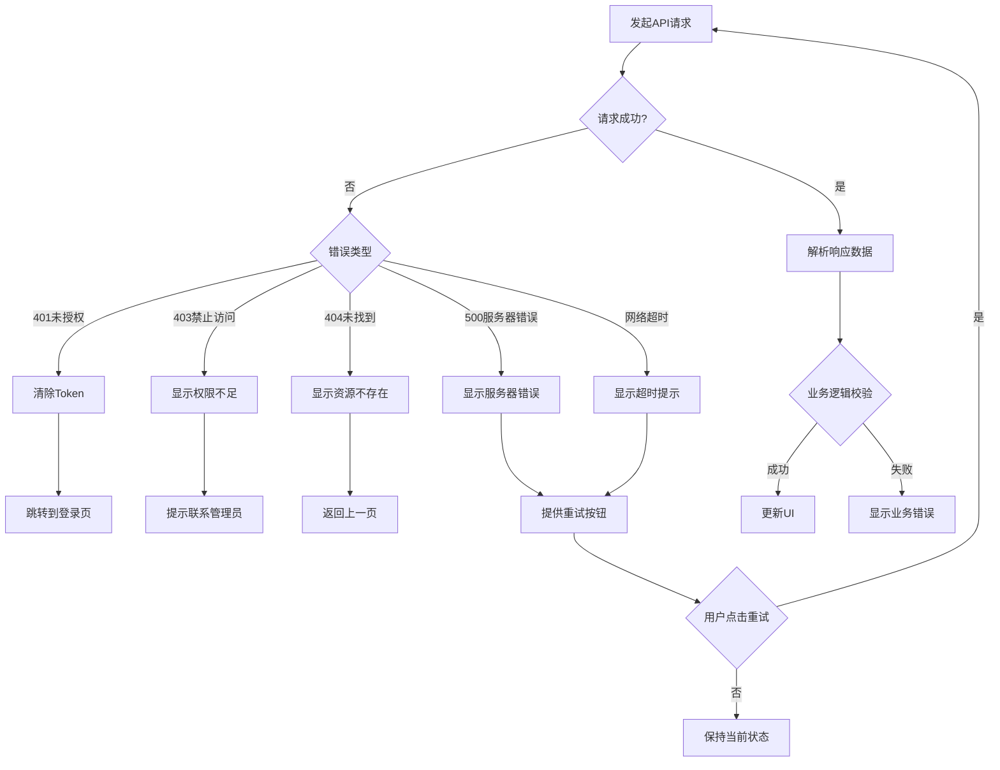

# OneStory 产品交互流程图

## 一、整体用户旅程流程


## 二、核心功能子流程

### 2.1 用户认证流程


### 2.2 项目管理流程


### 2.3 故事板编辑与AI生成流程


### 2.4 视频预览与导出流程


## 三、状态管理流程

### 3.1 数据持久化策略


### 3.2 消息通知流程


## 四、错误处理流程

### 4.1 API错误处理



### 4.2 AI生成失败处理


## 五、数据分析埋点流程

### 5.1 用户行为追踪


## 六、页面路由结构

```mermaid
graph TD
    A[/ 根路径] --> B[/dashboard Dashboard主页]
    A --> C[/login 登录页]
    A --> D[/showcase 案例展示]
    
    B --> E[/dashboard/projects 项目列表]
    B --> F[/dashboard/templates 模板库]
    B --> G[/dashboard/benefit 收益统计]
    B --> H[/dashboard/settings 设置]
    
    E --> I[/dashboard/:projectId/tableView 编辑器]
    F --> J[/dashboard/template/:templateId 模板详情]
    
    I --> K[模态窗口: 视频预览]
    I --> L[模态窗口: 角色编辑]
    I --> M[模态窗口: AI生成进度]
```

## 七、技术流程图

### 7.1 前端资源加载流程


### 7.2 CDN资源分发流程


## 八、移动端适配流程（未来规划）


---

**流程图说明**:
- 以上流程图使用 Mermaid 语法编写
- 可在支持 Mermaid 的 Markdown 渲染器中查看图形化展示
- 涵盖了 OneStory 平台的核心业务流程、技术架构流程和交互细节

**更新日期**: 2025-10-24
